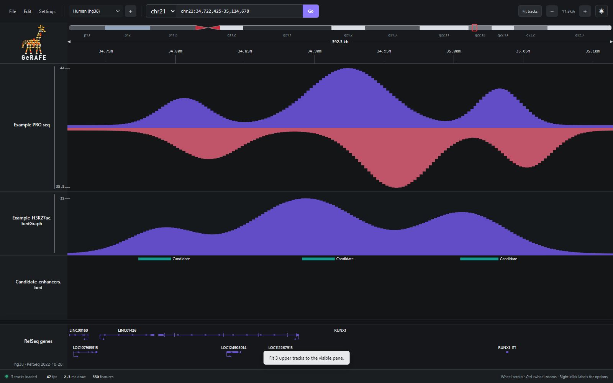

<h1 align="center">
  
  &nbsp;GeRAFE
</h1>

<p align="center"><strong>Genomic Renderer and Figure Editor</strong></p>

<p align="center">
  A fast, local-first desktop genome browser being built toward publication-quality genomic figure composition.
</p>

<p align="center">
  <a href="https://github.com/ariel-raskin/GeRAFE/actions/workflows/ci.yml"></a>
</p>

GeRAFE explores genomic signal, alignment, interval, and gene-annotation tracks directly from files on your computer. It provides responsive chromosome navigation, flexible track organization, and persistent workspaces without uploading genomic data.

GeRAFE is currently developed and tested as a Windows desktop application.



> [!IMPORTANT]
> GeRAFE is early research software. Validate displays against established tools before relying on them for analysis, and do not use the application for clinical decisions.

> [!NOTE]
> GeRAFE is not currently open-source software. Installation and use are limited
> to specifically invited beta testers under the
> [prerelease evaluation terms](BETA_TESTING.md).

## Features

- Smooth drag-to-pan and cursor-centered zooming across genomic coordinates.
- Search by hg38 gene symbol or enter chromosome coordinates directly.
- Built-in hg38 chromosome sizes, cytobands, and RefSeq gene/transcript annotations.
- Import custom reference assemblies from `.fai`, `.genome`, `.chrom.sizes`, and other two-column chromosome-size files.
- Two independently scrollable and resizable track panes with a fixed coordinate header.
- Reorder tracks by dragging and organize related tracks into groups.
- Select one or multiple tracks and edit their colors, heights, height locks, grouping, and shared type-specific display settings.
- Automatic visible-window or robust-percentile scaling, fixed ranges, linked scales, symmetric zero-centered domains, linear/log/symmetric-log transforms, filled/line/bar styles, opacity, and optional zero-flooring for quantitative tracks.
- Reversible signal stacks combine two or more ordinary quantitative tracks in one shared-scale row, with automatic shade and line-pattern differentiation, stack-wide fill/line controls, and per-member order and visibility.
- Automatic positive/negative signal pairing from common filename markers such as `plus`/`minus` and `pos`/`neg`, with one shared zero axis, red/blue strand colors, and independently scaled strand magnitudes.
- Stranded pairs remain compatible with groups; grouped autoscaling and color controls keep ordinary, positive, and negative channels separate.
- Collapsed, expanded, and squished interval and gene layouts, with BED labels, item-RGB/strand/score coloring, score filtering, row limits, representative/all-transcript selection, and per-track TSS indicators.
- Arc-style BEDPE interaction tracks with filters for score, cis distance, and displayed count; configurable anchors, names, color, width, opacity, and height; plus interchromosomal markers, top/bottom orientation, and annotation-aware gene filters.
- Indexed cis contact-map tracks from `.hic`, `.cool`, and multiresolution `.mcool` files, with zoom-aware resolution selection and triangular heatmap rendering.
- Persistent light and dark themes.
- Automatic restoration of local desktop tracks between launches, with relinking when a source has moved or changed.
- Versioned `.gerafe.json` workspace files with track layout, source provenance, and display settings, plus 100-step undo/redo while editing. Legacy `.locus.json` workspaces remain supported.

## Supported files

| Format | Extensions | Current display |
| --- | --- | --- |
| BigWig | `.bw`, `.bigWig` | Indexed quantitative signal with zoom summaries |
| bedGraph | `.bedGraph`, `.bedGraph.gz` | Quantitative signal; the desktop app creates and reuses an indexed local cache for compressed or large files |
| TDF | `.tdf` | Indexed IGV signal tiles, including compressed and uncompressed fixed-step, variable-step, BED, and BED-with-name tiles |
| BAM | `.bam` with `.bai` or `.csi` | Coverage and packed read alignments with CIGAR geometry, pairing, mismatches, indels, and splice gaps |
| BED | `.bed` | BED3–BED12 intervals, blocks, thick regions, strand, labels, scores, and item colors |
| BEDPE | `.bedpe` | Paired genomic interactions as arcs and anchor blocks; interchromosomal contacts use labeled markers |
| Hi-C | `.hic` | Indexed sparse cis contact matrices with source resolutions and KR/VC-family normalizations when present |
| Cooler | `.cool` | Indexed sparse cis contact matrices with raw counts and discovered balancing columns |
| Multires Cooler | `.mcool` | Zoom-aware sparse cis contact matrices across the file's available resolutions |

On desktop, GeRAFE automatically looks beside a BAM for conventional `sample.bam.bai`, `sample.bai`, `sample.bam.csi`, and `sample.csi` index names. When using the browser development build, select the BAM and its index together.

Large and gzip-compressed bedGraph sources are streamed into a private multiresolution BigWig cache under the operating system's GeRAFE cache directory. GeRAFE normally uses the active reference's chromosome sizes to build the cache in one pass, falling back to an additional discovery pass for chromosomes absent from the reference. The first open can take time because ordinary gzip files cannot be randomly accessed; later opens, workspace restoration, panning, and zooming reuse the indexed cache. Changing the source file invalidates and rebuilds its cache. GeRAFE does not place sidecar files beside the original data.

## Installation

Invited beta testers can install the current Windows build from the
[latest GeRAFE release](https://github.com/ariel-raskin/GeRAFE/releases/latest).
Download `GeRAFE_*_x64-setup.exe` and run it. The installer is per-user and does
not require administrator privileges.

GeRAFE's update packages are cryptographically signed and verified by the app.
The beta installer does not yet have a Windows Authenticode certificate, so
Microsoft SmartScreen may show a warning after a browser download.

### Requirements

- Windows 10 or 11.
- Microsoft Edge WebView2 Runtime. It is normally already installed on current Windows systems.

The following additional tools are needed only to build GeRAFE from source:

- [Node.js](https://nodejs.org/) 22.12 or newer and npm.
- Stable [Rust](https://www.rust-lang.org/tools/install) with the MSVC toolchain.
- Microsoft C++ Build Tools with **Desktop development with C++** enabled.

The native requirements are described in the official [Tauri prerequisites](https://v2.tauri.app/start/prerequisites/).

### Clone and run for development

```powershell
git clone https://github.com/ariel-raskin/GeRAFE.git
cd GeRAFE
npm ci
npm run desktop:dev
```

This compiles the Rust shell, starts the frontend development server, and opens the desktop application. Vite keeps its development dependency cache under `%LOCALAPPDATA%\\GeRAFE\\vite-cache` rather than inside the checkout, avoiding Dropbox and OneDrive file-lock conflicts.

### Install a development build locally

```powershell
npm ci
npm run desktop:install-local
```

This builds the release application in a machine-local cache outside the source checkout, installs it at `%LOCALAPPDATA%\Programs\GeRAFE\gerafe.exe`, and creates a **GeRAFE** Start Menu shortcut that launches the application directly without a terminal window. Open GeRAFE from Start, then right-click its taskbar icon and choose **Pin to taskbar**.

After pulling future source changes, close GeRAFE and run
`npm run desktop:install-local` again. This source-install command remains for
development; invited testers should normally use the release installer and
in-app updater.

For a first installation or routine update from an existing Windows checkout, you
can instead double-click **Install or Update GeRAFE.cmd**. See the
[multi-computer setup guide](docs/MULTI_COMPUTER_SETUP.md) for a GitHub-based
workflow and details about workspace and local-data behavior across computers.

### Build without installing

```powershell
npm ci
npm run desktop:build
```

The executable is written to:

```text
src-tauri/target/release/gerafe.exe
```

From an existing checkout, `Launch GeRAFE.cmd` opens the locally installed application after `npm run desktop:install-local` has been run.

### Updates

The installed desktop app checks for signed beta updates shortly after launch.
When one is available, review its notes and choose **Update and restart**. GeRAFE
saves the current workspace before downloading and never installs an update
silently. Use **Help → Check for updates** to check manually or **Help → About
GeRAFE** to see the installed version.

## Using the browser

### Open and navigate

- Open files with **File → Open tracks…**, `Ctrl+O`, or drag and drop.
- Search for a gene such as `RUNX1`, or enter a locus such as `chr8:127,700,001-127,900,000`.
- Drag horizontally over the track data to pan.
- Drag horizontally through blank track-area space as well as loaded tracks; the canvas fills the available pane even when its track stack is short.
- Hold `Ctrl` while using the mouse wheel to zoom around the pointer.
- Double-click the data area or use the toolbar `+` and `−` buttons to zoom.
- Drag the slider between the zoom buttons for direct chromosome-scale zoom control; its left edge shows the full chromosome and its right edge reaches base-level detail.
- Use the normal mouse wheel to scroll through tracks or an overflowing gene track.

### Saved regions and comparison dividers

Use the compact **Regions** menu beside **Fit tracks** to **Add region…** by dragging across the ruler or track area, or **Add current view as region…** directly. Holding `Ctrl` temporarily enables selection for the next left-button drag in the genomic plot. Saved regions keep a name, highlight color, genomic interval, and show/hide state. Their appearance panel chooses dashed, solid, or no boundary; fill on/off; and shade intensity, with the existing highlight updating live as the shade slider moves. This supports outline-only, fill-only, combined, or fully hidden interiors without drawing horizontal edges along track boundaries. Click a saved region to return to it; the adjacent controls toggle its highlight, show and edit its current color, rename it, or remove it. On ordinary tracks, hover either visible vertical boundary for the horizontal-resize cursor, then drag it to resize the saved interval. On a triangular cis matrix, the same cursor and drag action are available only on the two visible slanted sides of the region triangle.

Highlights stay below the coordinate ruler and use identical genomic bounds in both track panes. A triangular cis matrix highlights only cells whose two anchors both lie within the saved interval; rectangular/trans matrices use a horizontal-axis strip. **Snap selection to matrix bins** is enabled by default and rounds new selections or moved boundaries to the finest available enabled matrix grid; when no matrix resolution is available, coordinates remain unsnapped. Regions are stored in workspace schema v29. Changing the workspace reference clears saved regions so coordinates from one assembly are not shown on another.

The **Matrix outlines** section stores manual two-axis annotations independently from BEDPE overlays. Choose **Draw matrix outline…**, then drag across loaded matrix bins. The source matrix's resolution snaps both axes to complete bin edges; triangular cis maps display the resulting bin-space rectangle as a clipped parallelogram, while rectangular/trans maps use an axis-aligned rectangle. Hover a visible outline corner for the crosshair cursor, then drag it to resize both corresponding axes on that matrix's bin grid; the shared outline previews and updates on every assigned track. Multiple outlines can be named, shown or hidden, recolored, renamed, removed, and assigned explicitly to compatible matrix tracks. Drawing on a matrix in a matrix group targets compatible group members by default; an explicit multi-matrix selection or group right-click shortcut supplies that target set instead. Target membership is stored as a stable list, so later group changes do not silently change an annotation. Removing tracks prunes their membership and removes an outline only when no targets remain.

The comparison-divider section appears first in the Regions menu. **Add comparison divider…** changes the next click in the ruler or track area into a vertical genomic divider. Add multiple dividers, choose a dashed or solid style for each, recolor or remove each one, and hover then drag any visible line directly to move it. Its color control shows the current divider color. Ordinary and stranded signal tracks using automatic scaling calculate each resulting section independently; linked tracks remain linked within a section. Fixed signal ranges remain fixed in every section. BAM coverage uses a separate maximum per section. Interval, gene, BEDPE, individual-read, and matrix geometry are not rescaled. Section values label the active signal or coverage scales; stranded positive and negative values appear in their respective upper and lower halves.

GeRAFE disables the webview's eager saved-form popup for its text fields. Successful locus and dialog entries are remembered locally; matching history is offered only after typing and is limited to the current field.

### Manage tracks

- Click a track label to select it.
- Use `Ctrl`-click to toggle selection, `Shift`-click to select a range, or `Ctrl+A` outside a text field to select all visible tracks.
- Right-click a track label for organized Appearance, Display, Scale, Grouping, and Source controls. When multiple tracks are selected, the menu shows only actions supported by every selected track. Ordinary signal tracks can also clamp negative values to zero when those values are not meaningful.
- Recognizable complementary BigWig, bedGraph, and TDF signal files link automatically. Right-click the combined track to set strand colors, relink either source, or separate the pair again. Under **Settings → Track behavior**, choose whether to show TSS indicators, pair plus/minus tracks automatically, apply red/blue strand colors, and share scales when tracks are grouped.
- Drag selected tracks to reorder them or move them between the upper and lower areas, or use the corresponding **Move to upper/lower area** context-menu action. Moving only part of a visual group to the other area detaches those tracks from that group; moving every member preserves it. Hold the primary mouse button over a track body to select it without returning to its label. Hover over a track's bottom boundary for a quarter second, then drag vertically to resize that track. The numeric height command uses the same 20–4000 pixel range as dragging.
- Click a group card to select the entire group; right-click it for group-wide options.
- To compare ordinary BigWig, bedGraph, or TDF signals directly, select two or more compatible tracks and choose **Grouping → Collapse selected into signal stack**. Existing ordinary-signal-only groups can be collapsed from **Signal stack** in the group menu. A stack shares its y-axis by design; its flyout controls automatic shades, original colors, line patterns, translucent fills, opacity, member visibility, and member order. **Expand into separate tracks** restores the original track rows and their individual settings. Stack presentation is stored in workspace schema v30.
- The first-run interaction tip is also available later from **Help → Track interactions**, which groups navigation, selection, track-control, region, and matrix gestures into a compact quick-reference dialog. Settings and help dialogs close from their × button, the `Escape` key, or a click on the surrounding backdrop.
- Use **Fit tracks** to fit the visible upper tracks exactly into the available pane height. Long names retain enough height for two centered lines. **Lock track height** in a track's context menu reserves its current height and excludes it from manual and automatic fitting. The separate indicator on the right side of the button enables persistent automatic fitting as tracks or pane dimensions change. Each channel of a linked positive/negative pair receives the same height as a regular signal track.
- The lower gene track sizes itself to the visible layout; its small reference provenance label is informational and does not reserve additional layout space. Collapsed mode overlays representative gene structures on one baseline and uses two collision-aware name lanes, keeping its height bounded at wide genomic spans. Expanded and squished modes retain transcript stacking.
- BED menus can hide labels, color features by the track, BED item RGB, strand, or score, and set a minimum score or row ceiling. Gene menus choose a representative or all available transcripts and can override the global TSS-indicator preference for that track. The bundled RefSeq annotation does not include biotype metadata, so protein-coding-only filtering is not offered yet.
- BEDPE menus filter by score or cis-anchor distance, set a responsive displayed-interaction limit, and control arc height, anchors, names, color, line width, and opacity. When a limit applies, the track reports the number shown and retains the highest-scoring interactions.

### BAM display controls

BAM track menus provide:

- coverage plus alignments, coverage-only, or alignments-only views;
- expanded, collapsed, and squished read packing;
- paired-read display, independent mismatch/insertion/deletion-or-skip/soft-clip visibility, and a mismatch base-quality threshold;
- coloring by track, strand, pair orientation, or mapping quality;
- start/strand/MAPQ/insert-size ordering and strand/read-group/tag grouping;
- a displayed-read limit, safe hover-inspector mate navigation, and minimum MAPQ plus duplicate, secondary, or supplementary-alignment filters;
- a coverage alternate-allele-frequency highlight threshold. The orange coverage accent indicates the highest observed non-reference base in that screen bin. Its frequency is supporting reads divided by all passing reads overlapping the bin; total coverage is not filtered.

### Contact-matrix display controls

Right-click one or several selected `.hic`, `.cool`, or `.mcool` tracks to open hover fly-out menus for their shared resolution and normalization and a dedicated matrix-settings window for scaling, depth, and color. Resolution can follow the visible span automatically or use a value supported by every selected source. New tracks start with unnormalized values (`NONE` for `.hic`, raw counts for Cooler), robust 99th-percentile scaling, full-visible-span depth, and a publication-oriented yellow → red → deep-red scale. A light-blue → dark-blue → black palette, a single-color scale, and custom multi-stop palettes are also available.

Intensity can use the eligible maximum, a chosen robust percentile, or a fixed z-min/z-max range with either log or linear transformation. Automatic scaling can ignore a chosen number of near-diagonal bins without hiding those contacts. Matrix depth can use the bounded automatic range, the full visible span, common genomic-distance presets, or a custom distance. The triangular matrix can also be flipped above or below its baseline.

Matrix settings also offer observed contacts, observed/expected (O/E), and log2(O/E). O/E divides each nonzero contact by the mean at its genomic distance across the active chromosome. Cooler means include sparse zeros and respect the selected normalization and masked bins; `.hic` uses its stored expected vector. Log2(O/E) uses a symmetric blue–white–red scale, where white means O/E = 1. A fixed maximum is the magnitude on both sides of zero. Sparse zero contacts remain a distinct empty state because log2(0) is undefined. The first Cooler O/E query scans the active chromosome; subsequent queries reuse an in-memory expectation cache until the source file changes. O/E depth is limited to 2,000 bins at the selected resolution.

In the desktop app, select two matrix tracks and right-click to choose **Compare selected matrices → Difference, Ratio, or Log2 ratio**. The first track in track order is the numerator/minuend; a derived track keeps both original file paths in the workspace and can switch comparison mode from its context menu. Both inputs must have a common bin size and normalization; automatic resolution is chosen from their common sizes. Difference and log2 ratio have a signed, symmetric color scale. Sparse omitted contacts count as zero; a ratio with a zero denominator or log2 ratio with either zero is undefined and shown as missing when at least one source has a stored pixel. Masked bins and explicit missing pixels remain masked or missing. If a source file is replaced later, recreate the comparison track to bind the replacement.

Insulation and Compartment PC1 creation are no longer offered in the matrix menu: their chromosome-wide calculation needs a coarse matrix resolution that many files do not contain. Existing workspaces with these derived tracks still load, but those tracks may continue to show a resolution error with incompatible files. You can remove an existing derived track from its track menu; this does not remove the source matrix.

For independent horizontal and vertical genomic windows, right-click a native matrix track and choose **Set vertical locus…**. The main browser locus remains the horizontal axis. Enter a specific interval such as `chr8:50,000,001-52,000,000`, a chromosome name such as `chr8` (which opens a bounded central window), or a gene name such as `MYC` (centered using the active hg38 gene index; your matrix must use hg38 coordinates). You can explore any pair of regions, including different chromosomes; you do not need a previously known trans contact. A blank or weak rectangular map can mean there are few measured contacts, so compare with the matrix's coverage and normalization settings. Cooler intervals exceeding 1,200 bins at the selected resolution are rejected in the dialog; choose a smaller interval or a coarser resolution. **Shift+wheel** over the track pans vertically, and **Shift+Ctrl+wheel** zooms vertically. The vertical window is saved with the track in workspace schema v24; **Return to triangular view** clears it. Rectangular windows support raw/normalized observed contacts; O/E and matrix comparisons remain cis-only. Sparse zeros, explicit missing pixels, and normalization-masked bins retain distinct display/inspector states on both axes.

To compare called interactions with a contact map, open a BEDPE track, then right-click a matrix track or matrix-only group and choose **BEDPE overlay**. GeRAFE outlines the matrix cells containing those interactions without replacing their contact colors. The overlay reuses the BEDPE track's minimum-score, maximum cis-distance, gene-filter, color, opacity, line-width, and displayed-interaction limit settings. **Overlay focus** can retain all filtered interactions, only interactions matching entered gene symbols, or interactions involving a specific genomic region. The additional matrix outline limit defaults to 250 and can be raised to 2,000; when either limit truncates the result, a compact count appears on the matrix. In rectangular views, an interaction must connect the horizontal and vertical windows, so trans BEDPE pairs are highlighted when the two axes show their respective chromosomes. Overlay links and focus settings are saved in workspace schema v25; deleting the linked BEDPE track safely clears them.

The matrix inspector outlines the hovered cell and, by default, shows only its contact value or data state. Under **Settings → Track behavior → Matrix tracks**, the inspector can be turned off globally, its value, interacting-bin, and detail lines can be shown independently, and matrix color scales can be hidden across the app. Matrix labels stay compact; **Matrix details…** in a single matrix track's context menu opens a diagnostic view with requested and actual resolution, normalization, query axes and bin counts, returned data counts, elapsed query time, renderer path, and any loading or safety error. Per-track Matrix settings control sparse zero fill, explicit missing/NaN pixels, and normalization-masked bins. Masked-bin display is available when the active file reader exposes the required normalization mask.

GeRAFE reads genomic coordinates from each Cooler's stored bin table and canonicalizes the triangle orientation of both Cooler and `.hic` cells before drawing. Matrix readers and their indexes are reused across queries, and pans use an overscanned window. New tracks query the full visible genomic span by default; a bounded automatic-depth option remains available. Neither mode depends on track height, so resizing a track cannot silently multiply its contact query. Native queries are limited to 1,200 bins on either axis before large pixel arrays are read. Automatic `.hic` and `.mcool` views select an available resolution for the displayed span; an explicitly selected fine resolution, or a fixed-resolution `.cool` without a suitable bin size, stops with guidance to zoom in or choose a coarser/multiresolution source. Each source runs at most one native query at a time, and obsolete queued views are discarded before another native read begins.

### Workspaces and persistence

Desktop-opened source paths are retained locally and reopened on the same computer when GeRAFE starts again. If a file is missing or has changed, its track remains in the workspace and can be relinked.

In the desktop app, **File → Save workspace** writes back to the opened workspace. For a new or browser-opened workspace it opens the native **Save workspace as…** dialog first; use that command (or Ctrl+Shift+S) any time you want a copy in another location. GeRAFE remembers the last folder used for a workspace save and opens the next Save As dialog there. **Open workspace…** associates the selected file with later Save operations. In a web browser, both save commands download a `.gerafe.json` export because browser security does not allow GeRAFE to overwrite a chosen local file.

GeRAFE also opens legacy `.locus.json` workspaces. Workspace files contain layout, settings, paths, and provenance—not copies of genomic data. A workspace moved to another computer therefore requires access to, or relinking of, its source files.

## Current limitations

- The desktop application and release installer are currently built and tested on Windows x64 only.
- Release updates have a required Tauri updater signature but not yet a Windows Authenticode certificate, so SmartScreen may warn on the first installer download.
- The supported track formats are limited to those listed above.
- BEDPE is currently an in-memory arc track for files up to 50 MB. New tracks draw at most 2,000 highest-scoring interactions per visible window by default; the per-track limit can be adjusted up to 10,000.
- BEDPE matrix overlays outline called interactions but do not perform loop calling or statistical enrichment. A matrix-only group applies an overlay to its current matrix members; matrices added to the group later must be linked separately.
- Matrix comparisons require desktop-opened native files; legacy matrix-derived annotations also need their original desktop-opened matrix. Two-axis rectangular views currently support observed contacts only, not O/E or composite comparisons.
- Dense contact matrices (30,000 cells or more) reuse full-resolution raster tiles during panning; sparse maps use direct cell drawing. Tile memory is bounded at 32 MiB per track and 64 MiB total. Dense windows can fall back to direct drawing when they exceed that budget; bounded automatic depth is available when responsiveness matters more than off-diagonal reach.
- Custom references provide coordinate navigation but do not automatically include gene annotations or cytobands.
- Individual BAM reads are drawn below a 150 kb visible span; BAM requests are limited to 2 Mb to avoid unbounded pileups.
- Mismatches can be read from BAM MD tags. Reconstructing mismatches for BAMs without MD tags is unavailable because reference-sequence bases are not currently loaded.
- Browser-only development sessions cannot retain JavaScript `File` objects across a page reload; native desktop sessions can retain file paths.
- Ordinary signal tracks can be collapsed into shared-scale stacks. Stranded signal pairs currently use the shared-baseline diverging presentation with independent positive and negative magnitude scales; alternate stacked or fully separate presentations for those paired channels are not yet available.

## Development

Install dependencies and run the automated checks:

```powershell
npm ci
npm test
npm run build
```

Useful commands:

| Command | Purpose |
| --- | --- |
| `npm run dev` | Run the frontend in a browser |
| `npm run desktop:dev` | Run the Tauri desktop application in development mode using a machine-local Cargo target outside synced folders |
| `npm run desktop:build` | Build the production desktop executable |
| `npm run desktop:bundle` | Build the signed-update-compatible Windows NSIS installer (requires the private signing environment) |
| `npm run desktop:check-setup` | Check Windows desktop build prerequisites without installing |
| `npm run desktop:install-local` | Build and install the Windows app at its stable local path and create its Start Menu shortcut |
| `npm run version:check` | Verify package, Tauri, Cargo, and lockfile versions match |
| `npm run version:set -- 0.1.3` | Set all application version fields together |
| `npm test` | Run the Vitest unit suite |
| `npm run build` | Type-check and build the production frontend |
| `npm run smoke` | Start an isolated temporary development server, run the general browser smoke test, then stop it |
| `npm run benchmark:data -- "C:\path\to\signal.bw"` | Benchmark indexed BigWig reads |

Parser and renderer changes should also be checked with the relevant scripts under `scripts/` using real local files. Genomic test data and generated executables must not be committed.

## Privacy

GeRAFE reads genomic files locally. It does not upload tracks, workspaces, loci, or usage data, and it currently contains no telemetry. A saved workspace may contain absolute source paths, so inspect it before sharing it publicly.

## Beta testing and feedback

GeRAFE is currently being tested by specifically invited beta testers. Testers
may send feedback directly to the maintainer through the communication channel
arranged with them; a GitHub account is not required. External code
contributions are not currently being accepted. Please do not send private,
controlled-access, or unpublished genomic data with feedback. See
[BETA_TESTING.md](BETA_TESTING.md) for the limited evaluation permission and
[SECURITY.md](SECURITY.md) for security reports.

## License status

GeRAFE does not currently have an open-source license. Default copyright rules
therefore apply: the public repository may be viewed and forked under GitHub's
terms, but no general permission to modify, redistribute, or commercially use
GeRAFE has been granted. Specifically invited beta testers have only the limited
evaluation permission described in [BETA_TESTING.md](BETA_TESTING.md). A formal
software license may be selected later.

## Documentation

- [Release notes](CHANGELOG.md)
- [Contributing workflow](CONTRIBUTING.md)
- [Contact-matrix rendering and performance notes](docs/CONTACT_MATRIX_RENDERING.md)
- [Prerelease beta-testing terms](BETA_TESTING.md)
- [Development history before Git](docs/DEVELOPMENT_HISTORY.md)
- [Feasibility and performance notes](docs/FEASIBILITY.md)
- [Multi-computer Windows setup](docs/MULTI_COMPUTER_SETUP.md)
- [Release and in-app update workflow](docs/RELEASES.md)
- [Related genome browsers and visualization tools](docs/RELATED_TOOLS.md)
- [Semantic track system and browser/figure compatibility design](docs/TRACK_SYSTEM_DIRECTION.md)
- [Bundled reference-data sources](docs/THIRD_PARTY_DATA.md)
